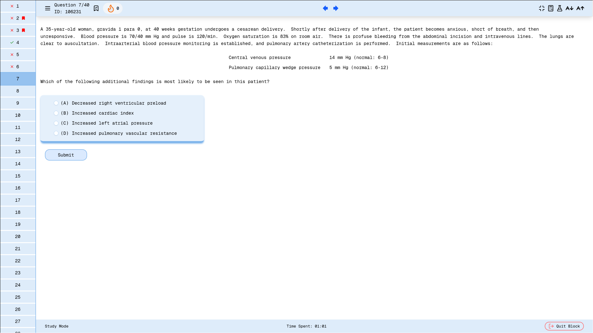
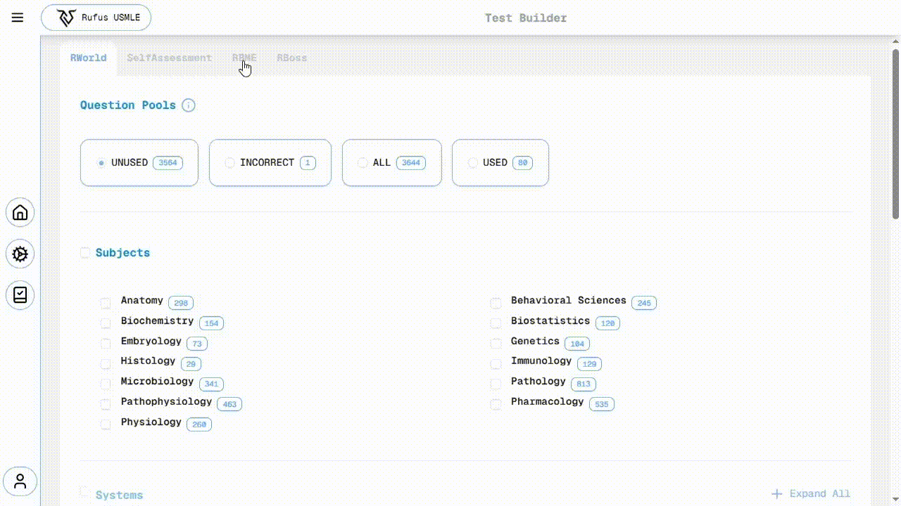
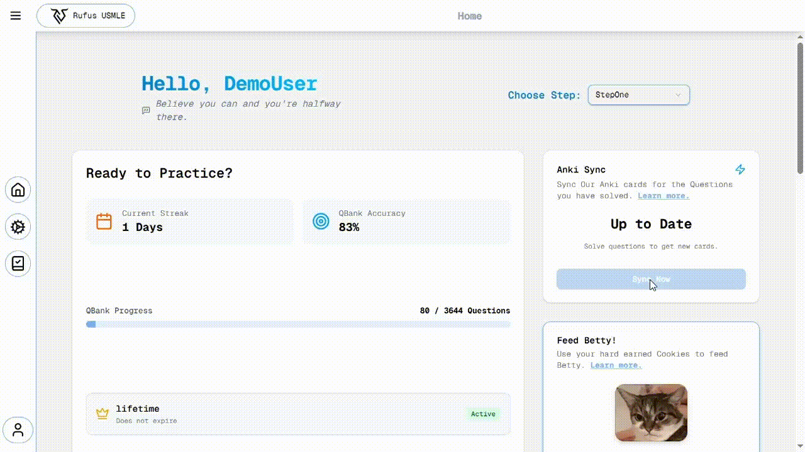

# 🩺 Rufus USMLE (SaaS Platform)

**Rufus USMLE** is a high-performance, commercial Qbank platform designed to simulate the exact testing environment of the USMLE (United States Medical Licensing Examination).

Unlike standard quiz apps, Rufus provides a **simulation-grade state machine**, a custom **desktop companion app** for flashcard synchronization, and a distraction-free simulated testing environment. It is built to handle complex user states, real-time analytics, and secure monetization.



## 🚀 Instant Demo Access

**Live Demo URL:** www.rufususmle.com

To immediately experience the platform's performance and features without sign-up:

1.  **Click the URL above** and navigate to the main page.
2.  Select the **"Try the Demo"** button. You will be automatically logged in as a demo user and redirected to the main Dashboard.
3.  From the Dashboard, navigate to **"Previous Tests"** and **continue** one of the premade test sessions to view the core **Test Interface** and features.

-----

## 🏗️ System Architecture

The platform operates on a modern **Full-Stack TypeScript** architecture, supported by a Python-based desktop companion.

  * **Frontend:** Next.js 14 (App Router), React, Tailwind CSS, Shadcn UI.
  * **Backend:** Node.js, Express, TypeScript.
  * **Database:** PostgreSQL, managed via Prisma ORM.
  * **Desktop Client:** Python (PyQt/Anki Add-on) for local flashcard synchronization.
  * **Infrastructure:** Docker, Caddy (Reverse Proxy), CI/CD pipelines.
  * **Observability:** The PLG Stack (Promtail, Loki, Grafana) + Pino.

-----

## 🚀 Key Technical Features

### 1\. High-Performance "Phantom" Demo Mode To allow users to test the full platform without signing up or polluting the database, I implemented a sophisticated **Demo Middleware** combined with **Optimistic UI** updates.
* **Optimistic UI:** The frontend never waits for the backend to confirm an action (like answering a question or highlighting text). It updates the interface immediately, making the testing experience **lightning fast**.
  * **The "Phantom" Middleware:** For demo users, the backend acts as a read-only cache.
      * **Read Operations (GET):** Responses are cached using `LRUCache`. If a request is repeated, it returns instantly from memory.
      * **Write Operations (POST/PUT):** The middleware intercepts these requests and immediately returns a `200 OK` status **without touching the database**. Because the frontend relies on optimistic updates, the user sees their changes "persist" locally during the session, creating a seamless experience with zero database cost.
  * **Response Hijacking:** The middleware cleverly binds to `res.json` to cache fresh data on the fly before sending it to the client:

<!-- end list -->

```typescript
// Middleware Snippet: Hijacking res.json to cache data transparently
const originalJsonMethod = res.json.bind(res);

res.json = function (body?: any) {
  if (res.statusCode >= 200 && res.statusCode < 300) {
    // Cache the fresh response for future GET requests
    cache.set(req.originalUrl, body);
    logger.debug(`cache set for ${req.originalUrl}`);
  }
  // Proceed with sending the response
  return originalJsonMethod(body);
};
```

### 2\. The Simulation State Machine One of the most complex backend challenges was creating a "Time-Travel" capable state machine. In a real exam, time does not stop. If a user closes their browser during a simulated exam block and returns 2 hours later, the system must calculate exactly where they *should* be.

  * **Auto-Sync Logic:** The `TestSessionManager` acts as the source of truth. It uses a recursive `manageTestState` loop to fast-forward simulated time. It calculates transitions between simulated states (`ON_BLOCK` $\rightarrow$ `JUST_FINISHED_BLOCK` $\rightarrow$ `ON_BREAK` $\rightarrow$ `NEXT_BLOCK`) based strictly on server-time deltas.
 * **Testing:** Given the critical nature of the testing environment, the entire state machine was rigorously tested using Jest to guarantee correct, deterministic behavior under all time-sync and transition scenarios.



   
### 3\. The Anki Sync Ecosystem (Web $\leftrightarrow$ Desktop) Rufus features a novel integration with **Anki**, allowing users to unlock flashcards automatically as they solve questions. The synchronization flow is a secure, multi-step handshake:

1.  **Initiation:** The user clicks "Sync" on the web dashboard. The frontend requests a secure, one-time `SyncToken` from the backend.
2.  **Localhost Bridge:** The frontend posts this token to `localhost:8765`. This endpoint is hosted by the **Rufus Companion Add-on** (a fork of *AnkiConnect*) running locally on the user's machine.
3.  **Secure Fetch:** The Add-on uses the token to authenticate with the Rufus Backend and requests the sync process to start.
4.  **Batch Processing:** The backend prepares a pool of cards based on the user's answered questions (`UserCardsSyncPool`). The Add-on fetches these in batches, and upon successful insertion into Anki, notifies the backend to mark them as `syncedAt`, ensuring no data is lost or duplicated.




### 4\. Gamification & "Betty" System

To prevent burnout, the platform includes a gamified reward system centered around "Betty" (the app's mascot).

  * **Cookies & Rewards:** Users earn "Cookies" for completing blocks and maintaining streaks.
  * **Leaderboard:** Users can "feed" Betty their cookies to climb the global leaderboard. The backend aggregates these scores using optimized queries (`orderBy: { cookiesSpent: 'desc' }`) to drive competition and engagement.


-----

## 💳 Infrastructure & Monetization

### Payments (Lemon Squeezy)

The platform integrates **Lemon Squeezy** for handling global SaaS subscriptions.

  * **HMAC Security:** Webhooks are verified using a cryptographic HMAC digest (`crypto.createHmac`) comparing the request signature against the raw body to prevent replay or spoofing attacks.
  * **Subscription Lifecycle:** The `processLemonSqueezyEvent` handler automatically manages plan provisioning, renewals, cancellations, and grace periods via database upserts using Prisma.

### Observability (PLG Stack)

Full-stack observability is implemented to monitor simulated exams in real-time.

  * **Logging:** Uses **Pino** for structured, low-overhead JSON logging in the backend.
  * **Aggregation:** **Promtail** scrapes logs and ships them to **Loki**.
  * **Visualization:** **Grafana** Dashboards provide insight into API latency, error rates, and simulation engine health.

-----

## 💾 Database Design (Prisma)

The simulated environment requires a complex relational schema.

  * **Recursive Questions:** The `Question` model supports self-relation (`parentQuestionId`) to handle "Vignette" style questions where one case description applies to multiple child questions.
  * **Versioning:** A `QuestionVersion` table decouples content editing from user attempts.
  * **Polymorphic Testing:** The `Test` model supports multiple `TestModes` (`SIMULATION`, `STUDY`, `EXAM`) and `BlockLayouts`, fundamentally altering how the `TestBlock` logic behaves.

-----

## 🎨 Frontend & UX

  * **PWA (Progressive Web App):** The application is fully installable. The `site.webmanifest` and maskable icons ensure a native-app feel on mobile devices.
  * **Smart Highlighting Engine:** A custom engine (`HighlightsEngine`) handles complex text selection, merging overlapping highlights and ensuring performant rendering even with hundreds of DOM nodes.

-----

*Note: This repository is a closed-source commercial product. This README serves as technical documentation of the architecture and implementation details.*
